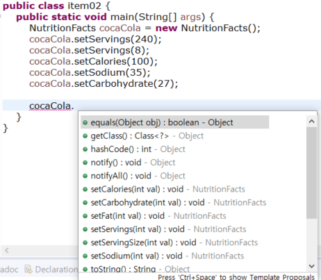
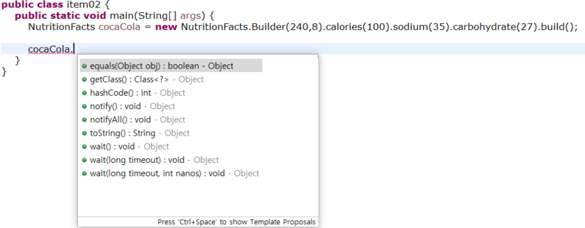

## Item 2: Consider a builder when faced with many constructor parameters
(생성자 인자가 많을 때는 Builder패턴 적용을 고려하라)

** 아래에서 소개될 패턴들**
1. Telescoping constructor pattern
2. JavaBeans Pattern
3. Builder Pattern
  
***
```java
// Telescoping constructor pattern - does not scale well!
public class NutritionFacts {
	private final int servingSize; // (mL) required
	private final int servings; // (per container) required
	private final int calories; // optional
	private final int fat; // (g) optional
	private final int sodium; // (mg) optional
	private final int carbohydrate; // (g) optional

	public NutritionFacts(int servingSize, int servings) {
		this(servingSize, servings, 0);
	}

	public NutritionFacts(int servingSize, int servings, int calories) {
		this(servingSize, servings, calories, 0);
	}

	public NutritionFacts(int servingSize, int servings, int calories, int fat) {
		this(servingSize, servings, calories, fat, 0);
	}

	public NutritionFacts(int servingSize, int servings, int calories, int fat, int sodium) {
		this(servingSize, servings, calories, fat, sodium, 0);
	}

	public NutritionFacts(int servingSize, int servings, int calories, int fat, int sodium, int carbohydrate) {
		this.servingSize = servingSize;
		this.servings = servings;
		this.calories = calories;
		this.fat = fat;
		this.sodium = sodium;
		this.carbohydrate = carbohydrate;
	}

	public static void main(String[] args) {
		NutritionFacts cocaCola = new NutritionFacts(240, 8, 100, 0, 35, 27);
	}
}
```
기본으로 생성자를 만드는 방법이다.  

인스턴스변수 6개 중 2개는 필수, 4개는 선택이다.   

자바 입문 서적에서 생성자를 설명할 때 다루는 방법이다.  

일단 가독성이 떨어져서 유지보수가 용이하지 못하다.

또, 네이밍이 없어서 실수할 가능성이 크다.

***

```java
// JavaBeans Pattern - allows inconsistency, mandates mutability
public class NutritionFacts {
	// Parameters initialized to default values (if any)
	private int servingSize = -1; // Required; no default value
	private int servings = -1; //Required;
	private int calories = 0;
	private int fat = 0;
	private int sodium = 0;
	private int carbohydrate = 0;

	public NutritionFacts() {
	}

	// Setters
	public void setServingSize(int val) {
		servingSize = val;
	}

	public void setServings(int val) {
		servings = val;
	}

	public void setCalories(int val) {
		calories = val;
	}

	public void setFat(int val) {
		fat = val;
	}

	public void setSodium(int val) {
		sodium = val;
	}

	public void setCarbohydrate(int val) {
		carbohydrate = val;
	}

	public static void main(String[] args) {
		NutritionFacts cocaCola = new NutritionFacts();
		cocaCola.setServingSize(240);
		cocaCola.setServings(8);
		cocaCola.setCalories(100);
		cocaCola.setSodium(35);
		cocaCola.setCarbohydrate(27);
	}
}
```

객체 생성이후에 그 객체가 완전히 생성이 끝났다고 할수없다.  

객체 일관성이 깨질수가 있는것이다.   

여기서는 생성자 인자가 유효한지 검사하여 일관성을 보장하는 단순한 방법을 사용할 수 없다.  

또한 이 패턴으로는 Immutable Class를 만들 수 없다. 아래와 같이 언제든지 상태를 바꿀 수가 있다.  

 </Img>  

thread-Safety하다고도 볼수없다.  

***

```java
// Builder Pattern
public class NutritionFacts {
    private final int servingSize;
    private final int servings;
    private final int calories;
    private final int fat;
    private final int sodium;
    private final int carbohydrate;

    public static class Builder {
        // Required parameters
        private final int servingSize;
        private final int servings;

        // Optional parameters - initialized to default values
        private int calories      = 0;
        private int fat           = 0;
        private int carbohydrate  = 0;
        private int sodium        = 0;

        public Builder(int servingSize, int servings) {
            this.servingSize = servingSize;
            this.servings    = servings;
        }

        public Builder calories(int val) {
            calories = val;
            return this;
        }

        public Builder fat(int val) {
            fat = val;
            return this;
        }

        public Builder carbohydrate(int val) {
            carbohydrate = val;
            return this;
        }

        public Builder sodium(int val) {
            sodium = val;
            return this;
        }

        public NutritionFacts build() {
            return new NutritionFacts(this);
        }
    }

    private NutritionFacts(Builder builder) {
        servingSize  = builder.servingSize;
        servings     = builder.servings;
        calories     = builder.calories;
        fat          = builder.fat;
        sodium       = builder.sodium;
        carbohydrate = builder.carbohydrate;
    }
}
```
```java
	NutritionFacts cocaCola = new NutritionFacts.Builder(240,8).calories(100).sodium(35).carbohydrate(27).build();
```

 </Img>  
  
Object Method만 보인다. 객체 생성이후 객체상태를 변경할 수 없다.  
  
Builder Pattern은 인자가 많은 생성자나 특히 대부분의 인자가 선택적 인자인 상황에 유용하다.  

우선 생성자와 static factory method로 객체생성하기로 했더라도,해당 클래스에 인자가 추가되면 빌더패턴을 적용해야 할것이다.  

하지만 이때는 미리 만들어둔 constructor와 static factor method를 걷어내야 한다.  

확장가능성을 잘 보면서 객체를 어떻게 생성할것인지 정하자.  

